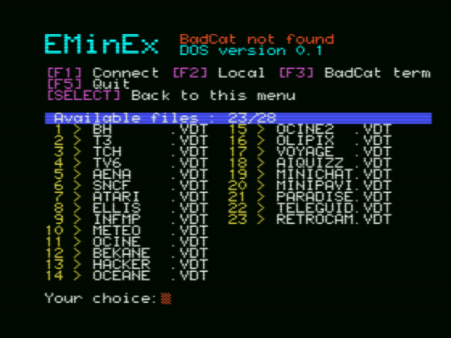
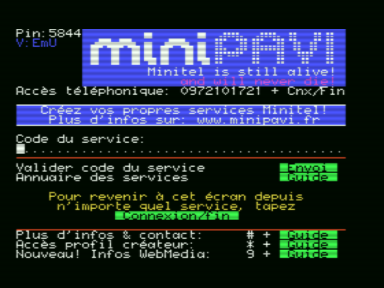
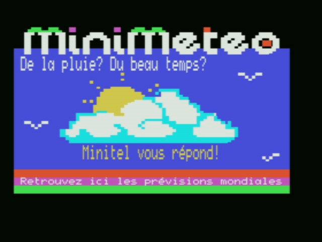

[🇬🇧 English version](#eminex-when-the-msx-becomes-a-minitel-version-01)

# EMinEx : Quand le MSX joue au Minitel (version 0.1) 

**EMinEx** est un émulateur Minitel (norme **Vidéotex CEPT2**) conçu pour fonctionner sur les ordinateurs **MSX1**. Oui, vous avez bien lu : votre MSX peut désormais se prendre pour un Minitel !  

Grâce à une cartouche **BadCat Modem WiFi** ([disponible ici](https://sites.google.com/view/badcatelectronics/msx/badcat-wifi-modem)), il est possible d’accéder aux services Vidéotex via le point d’accès **MiniPavi** ([voir ici](https://www.minipavi.fr/)).  

Une vidéo Youtube de démonstration est disponible [ici](https://youtu.be/pvBjVk3af6c).

Le programme est disponible en deux versions :  
- **Cassette** (chargement via `BLOAD "CAS:",R` pour les amateurs de nostalgie et de patience).  
- **Disquette (MSX-DOS 1)** (chargement plus rapide pour les plus pressés).  

## 🎛️ Options disponibles au lancement  
- **F1** : Connexion à MiniPavi pour accéder aux services Minitel.  
- **F2** : Mode local pour saisir directement du Vidéotex (ex. : `ESC` + `A` pour du texte rouge).  
- **F3** : Mode terminal permettant d’envoyer des commandes au modem (`ATA`, `ATI`…). Ici, pas d’interprétation Vidéotex, c’est brut de décoffrage.  
- **F5** : Quitter le programme avec grâce et élégance.  

En version disquette, **EMinEx** permet également d’afficher des fichiers Vidéotex (`.VDT`) stockés sur le disque.  

📌 **Astuce** : À tout moment, la touche **SELECT** permet de revenir au menu principal (pratique en cas de panique).  

---

## 🔗 Connexion à MiniPavi  
Le logiciel établit automatiquement une connexion vers **go.minipavi.fr:516**. Une fois en ligne, il ne vous reste plus qu’à suivre les indications et explorer les services disponibles.  

### ⌨️ Correspondance des touches MSX ⮕ Minitel  
| **MSX** | **Minitel** |
|---------|------------|
| **Return** | Envoi |
| **Flèche bas** | Suite |
| **Flèche haut** | Retour |
| **Flèche gauche** | Sommaire |
| **Flèche droite** | Répétition |
| **Backspace** | Correction |
| **Suppr** | Annulation |
| **Ins** | Guide |
| **Esc** | Connexion/Fin |

---

## ⚠️ Limitations (parce que rien n’est parfait)  
- L’affichage du **MSX1** (mode **SCR2**) ne permet pas une fidélité absolue : attendez-vous à quelques imperfections visuelles.  
- L’émulation atteint environ **90 %** de fidélité : certains artefacts peuvent apparaître.
- La saisie de caractères accentués n'est pas pris en charge (leur affichage, si)
- Fonctionnalités non prises en charge : clignotement, séquences CSI, certaines commandes du protocole (blocage majuscules/minuscules, etc.), DRCS, mode 80 colonnes...  
- **L’affichage est limité à 40 colonnes × 24 lignes**, alors que le Minitel utilise 40 × 25. Résultat : la première ligne du Minitel (**ligne 00**) s’affiche brièvement sur la ligne 1 avant d’être remplacée.
- **Enfin, si vous tombez sur un bug, dites-vous que c’est une fonctionnalité imprévue… et soyez indulgents !**  

---

## 🛠️ Aspect technique  
L’objectif initial était de fournir un émulateur Minitel fonctionnel sur **MSX1**, avec une compatibilité cassette pour une accessibilité maximale.  

Le développement s’est appuyé sur la **MSXgl** ([disponible ici](https://aoineko.org/msxgl/)).  
Un immense merci à **Aoineko** pour sa patience face à mes nombreuses questions sur le développement MSX !  

---

Si vous avez toujours rêvé d’un Minitel sur MSX, **EMinEx** est là pour exaucer votre souhait.  
**Profitez bien du voyage temporel ! 🚀**  

---

# EMinEx: When the MSX Becomes a Minitel (version 0.1)

**EMinEx** is a Minitel emulator (**Vidéotex CEPT2** standard) designed to run on **MSX1** computers. Yes, you read that right: your MSX can now impersonate a Minitel!

With a **BadCat WiFi Modem** cartridge ([available here](https://sites.google.com/view/badcatelectronics/msx/badcat-wifi-modem)), you can access Vidéotex services via the **MiniPavi** gateway ([see here](https://www.minipavi.fr/)).

A demo Youtube video is available [here](https://youtu.be/pvBjVk3af6c).

The program is available in two versions:
- **Cassette** (loaded via `BLOAD "CAS:",R` for those who enjoy nostalgia and patience).
- **Floppy Disk (MSX-DOS 1)** (faster loading for the more impatient users).

## 🎛️ Available Options at Startup
- **F1**: Connect to MiniPavi to access Minitel services.
- **F2**: Local mode to directly enter Vidéotex commands (e.g., `ESC` + `A` for red text).
- **F3**: Terminal mode allowing direct modem command input (`ATA`, `ATI`...). In this mode, text is displayed as raw data, without Vidéotex interpretation.
- **F5**: Exit the program with style and grace.

In floppy disk mode, **EMinEx** also allows viewing **Vidéotex files** (`.VDT`) stored on the disk.

📌 **Tip**: At any time, press **SELECT** to return to the main menu (a lifesaver in moments of panic).

---

## 🔗 Connecting to MiniPavi
The software automatically establishes a connection to **go.minipavi.fr:516**. Once online, simply follow the instructions and explore the available services.

### ⌨️ MSX ⮕ Minitel Key Mapping
| **MSX Key** | **Minitel Equivalent** |
|------------|-----------------------|
| **Return** | Send (Envoi) |
| **Down Arrow** | Next (Retour) |
| **Up Arrow** | Back (Correction) |
| **Left Arrow** | Home (Sommaire) |
| **Right Arrow** | Repeat (Répétition) |
| **Backspace** | Correction (Correction) |
| **Delete** | Cancel (Annulation) |
| **Insert** | Guide (Guide) |
| **Esc** | Connect/Exit (Connexion/Fin) |

---

## ⚠️ Limitations (Because Nothing is Perfect)
- The **MSX1** display mode (**SCR2**) does not allow for 100% accurate Vidéotex rendering, so expect some visual artifacts.
- The emulation achieves around **90%** fidelity, meaning some display glitches may occur.
- Several Vidéotex features are **not supported**: blinking text, CSI sequences, certain protocol commands (e.g., uppercase/lowercase locking), DRCS, 80 columns mode, etc.
- **Accented characters input is not supported**, though they are correctly displayed.
- The display is **limited to 40 columns × 24 lines**, whereas the Minitel uses **40 × 25 lines**. Consequently, the first line of the Minitel (**line 00**) briefly appears on line 1 before being replaced.
- **And finally, if you encounter a bug, just consider it an unexpected feature… and be forgiving!**

---

## 🛠️ Technical Details
The initial goal was to create a functional **Minitel emulator for MSX1**, with cassette compatibility for broader accessibility.

The development relied on **MSXgl** ([available here](https://aoineko.org/msxgl/)).
A huge thank you to **Aoineko** for patiently answering my numerous questions about MSX development!

---

If you've always dreamed of having a Minitel on your MSX, **EMinEx** is here to make that dream come true.

**Enjoy the time-traveling experience! 🚀**

