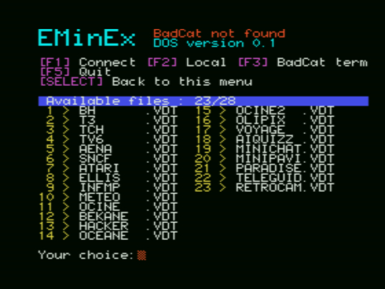
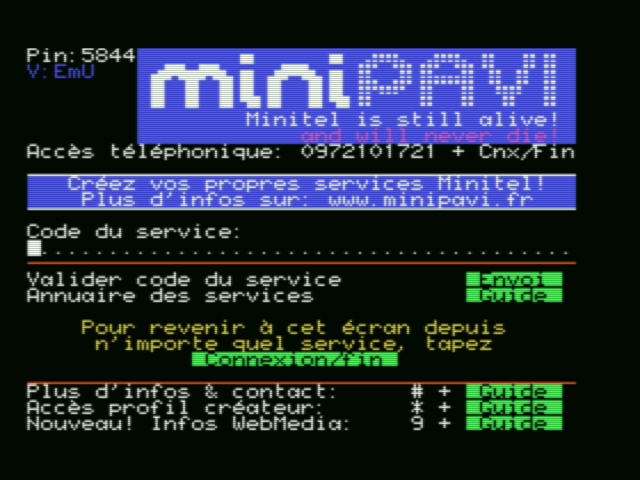
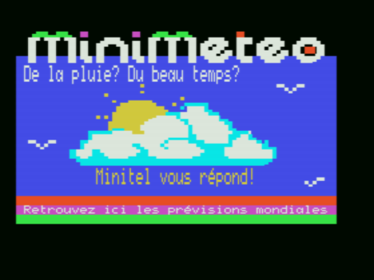

| [🇬🇧 English version](#eng) | [🇪🇸 Versión en español](#esp) | [Changelog](#log) |
|----------------------------|-----------------------------|------------------|

# EMinEx : Quand le MSX joue au Minitel

**EMinEx** est un émulateur Minitel (norme **Vidéotex CEPT2**) conçu pour fonctionner sur les ordinateurs **MSX1** (64Ko min). Oui, vous avez bien lu : votre MSX peut désormais se prendre pour un Minitel !  

Il ne nécessite aucun driver particulier.

Minitel, commercialement exploité en France entre 1980 et 2012, a été le premier service au monde à donner accès à des services variés préfigurant ceux du futur Internet grand public, et le plus développé en 1990, avec près de 7 millions de foyers équipés. Il utilisait la norme Videotex, profile CEPT-2 (au contraire de Prestel au Royaume-Uni qui utilisait le Videotex profile CEPT-3 ou Ibertex en Espagne qui utilisait le profile CEPT-1)

Grâce à une cartouche **BadCat Modem WiFi** ([disponible ici](https://sites.google.com/view/badcatelectronics/msx/badcat-wifi-modem)) ou tout autre Modem WiFi (équipé d'une UART type 16C550) utilisant les ports standard RS232 du MSX (0x80...) équipé du firmware Zimodem, il est possible d’accéder aux services Vidéotex via le point d’accès **MiniPavi** ([voir ici](https://www.minipavi.fr/)), lequel offre aujourd'hui un panel de différents services actifs (et qui vous permet également de créer le vôtre !).  

Une vidéo Youtube de démonstration est disponible [ici](https://youtu.be/pvBjVk3af6c).

Le programme est disponible en deux versions :  
- **Cassette** (chargement via `BLOAD "CAS:",R` pour les amateurs de nostalgie et de patience).  
- **Disquette (MSX-DOS 1)** (chargement plus rapide pour les plus pressés).  

## 🎛️ Options disponibles au lancement  
- **F1** : Connexion à MiniPavi pour accéder aux services Minitel.  
- **F2** : Mode local pour saisir directement du Vidéotex (ex. : `ESC` + `A` pour du texte rouge).  
- **F3** : Mode terminal permettant d’envoyer des commandes au modem (`ATA`, `ATI`…) reconnues par le firmware Zimodem. Ici, pas d’interprétation Vidéotex, c’est brut de décoffrage.  
- **F5** : Quitter le programme avec grâce et élégance.  

En version disquette, **EMinEx** permet également d’afficher des fichiers Vidéotex (`.VDT`) stockés sur le disque.  

📌 **Astuce** : À tout moment, la touche **SELECT** permet de revenir au menu principal (pratique en cas de panique).  

---

## 🔗 Connexion à MiniPavi  
Le logiciel établit automatiquement une connexion vers **go.minipavi.fr:516**. Une fois en ligne, il ne vous reste plus qu’à suivre les indications et explorer les services disponibles.  

### ⌨️ Correspondance des touches MSX ⮕ Minitel  
| **MSX** | **Minitel** |
|---------|------------|
| **Return** | Envoi |
| **Flèche bas** | Suite |
| **Flèche haut** | Retour |
| **Flèche gauche** | Sommaire |
| **Flèche droite** | Répétition |
| **Backspace** | Correction |
| **Suppr** | Annulation |
| **Ins** | Guide |
| **Esc** | Connexion/Fin |

---

## ⚠️ Limitations (parce que rien n’est parfait)  
- L’affichage du **MSX1** (mode **SCR2**) ne permet pas une fidélité absolue : attendez-vous à quelques imperfections visuelles.  
- L’émulation atteint environ **90 %** de fidélité : certains artefacts peuvent (vont) apparaître.
- La saisie de caractères accentués n'est pas pris en charge (leur affichage, si)
- Fonctionnalités non prises en charge : clignotement, séquences CSI, certaines commandes du protocole (blocage majuscules/minuscules, etc.), DRCS, masquage, mode 80 colonnes...  
- **L’affichage est limité à 40 colonnes × 24 lignes**, alors que le Minitel utilise 40 × 25. Résultat : la première ligne du Minitel (**ligne 00**) s’affiche brièvement sur la ligne 1 avant d’être remplacée.
- **Enfin, si vous tombez sur un bug, dites-vous que c’est une fonctionnalité imprévue… et soyez indulgents !**  

---

## 🛠️ Aspect technique  
L’objectif initial était de fournir un émulateur Minitel fonctionnel sur **MSX1**, avec une compatibilité cassette pour une accessibilité maximale.  

Le développement s’est appuyé sur la **MSXgl** ([disponible ici](https://aoineko.org/msxgl/)).  
Un immense merci à **Aoineko** pour sa patience face à mes nombreuses questions sur le développement MSX !  

### Affichage Vidéotex sur MSX : Un défi digne des plus grands !  

Affichage Vidéotex et MSX 1… Deux mondes bien différents qui n’étaient pas vraiment faits pour s’entendre.  
D’un côté, un écran de **25 lignes de 40 caractères** en **10x8 pixels**, soit une résolution de **250x320**, avec une palette de **8 couleurs** et une contrainte : **seulement 2 couleurs par caractère**.  
De l’autre, le vénérable **MSX 1**, affichant **24 lignes de 32 caractères** en **8x8 pixels**, pour une résolution de **192x256**, avec une limitation bien connue : **pas plus de 2 couleurs par ligne de 8 pixels en mode Screen 2**.  

Ajoutez à cela le support du **scrolling vertical** (haut et bas, s’il vous plaît), des caractères en **double hauteur**, **double largeur** et **double taille** pour le Minitel, spécificités inconnues du MSX 1 ! Bref, un défi technique passionnant !  

### Deux approches étaient possibles  

1. **Afficher uniquement 32 caractères par ligne** et permettre un **scrolling horizontal** pour découvrir les 8 caractères cachés.  
2. **Redéfinir l’écran pour afficher 40 caractères de 6 pixels de large**, une solution plus élégante… mais aussi bien plus corsée.  

J’ai choisi la deuxième option. **Parce que pourquoi faire simple quand on peut faire compliqué ?** 😃  

### Une gymnastique de pixels et de couleurs  

Chaque caractère fait donc **6 pixels de large x 8 pixels de haut** et s’étale *à cheval* sur deux tuiles adjacentes, avec un **décalage cyclique variable**.

Une gymnastique qui ne concerne pas seulement les pixels : **les couleurs doivent suivre**, et ce n'est pas une mince affaire !  

En effet, avec ce décalage, on peut se retrouver avec **jusqu’à 4 couleurs par ligne de 8 pixels**, alors que le mode **Screen 2** du MSX impose **2 couleurs par ligne de 8 pixels**.  

Un vrai casse-tête de palette !  

### Résultat final  

L’écran affiche bien **40 caractères sur 24 lignes**.  
Pourquoi **24 et non 25** comme sur un Minitel ?  
Parce que le décalage au niveau des colonnes était déjà assez compliqué, et je n'allais pas y ajouter un décalage au niveau des lignes !
Ainsi, la ligne 00 (celle du haut) est affichée en **ligne 1**, mais reste traitée en interne comme une **ligne 0**.  

Un petit tour de passe-passe qui permet d’aligner les étoiles… ou plutôt **les pixels** ! ✨  

---

Si vous avez toujours rêvé d’un Minitel sur MSX, **EMinEx** est là pour exaucer votre souhait.  
**Profitez bien du voyage temporel ! 🚀**  

---

# EMinEx: When the MSX Becomes a Minitel

**EMinEx** is a Minitel emulator (**Vidéotex CEPT2** standard) designed to run on **MSX1** computers. Yes, you read that right: your MSX can now impersonate a Minitel!

It does not require any specific driver.

Minitel, commercially operated in France between 1980 and 2012, was the world's first service to provide access to a variety of services foreshadowing those of the future public Internet. It was also the most developed in 1990, with nearly 7 million households equipped. It used the Videotex standard, CEPT-2 profile (unlike Prestel in the United Kingdom, which used the CEPT-3 Videotex profile, or Ibertex in Spain, which used the CEPT-1 profile).

With a **BadCat WiFi Modem** cartridge ([available here](https://sites.google.com/view/badcatelectronics/msx/badcat-wifi-modem)) or any other WiFi modem (with UART type 16C550) using the standard RS232 I/O ports of the MSX (0x80...) equipped with the Zimodem firmware, you can access Vidéotex services via the **MiniPavi** gateway ([see here](https://www.minipavi.fr/)) which currently offers a range of active services (and also allows you to create your own!).

A demo Youtube video is available [here](https://youtu.be/pvBjVk3af6c).

The program is available in two versions:
- **Cassette** (loaded via `BLOAD "CAS:",R` for those who enjoy nostalgia and patience).
- **Floppy Disk (MSX-DOS 1)** (faster loading for the more impatient users).

## 🎛️ Available Options at Startup
- **F1**: Connect to MiniPavi to access Minitel services.
- **F2**: Local mode to directly enter Vidéotex commands (e.g., `ESC` + `A` for red text).
- **F3**: Terminal mode allowing direct modem command input (`ATA`, `ATI`...). In this mode, text is displayed as raw data, without Vidéotex interpretation.
- **F5**: Exit the program with style and grace.

In floppy disk mode, **EMinEx** also allows viewing **Vidéotex files** (`.VDT`) stored on the disk.

📌 **Tip**: At any time, press **SELECT** to return to the main menu (a lifesaver in moments of panic).

---

## 🔗 Connecting to MiniPavi
The software automatically establishes a connection to **go.minipavi.fr:516**. Once online, simply follow the instructions and explore the available services.

### ⌨️ MSX ⮕ Minitel Key Mapping
| **MSX Key** | **Minitel Equivalent** |
|------------|-----------------------|
| **Return** | Send (Envoi) |
| **Down Arrow** | Next (Retour) |
| **Up Arrow** | Back (Correction) |
| **Left Arrow** | Home (Sommaire) |
| **Right Arrow** | Repeat (Répétition) |
| **Backspace** | Correction (Correction) |
| **Delete** | Cancel (Annulation) |
| **Insert** | Guide (Guide) |
| **Esc** | Connect/Exit (Connexion/Fin) |

---

## ⚠️ Limitations (Because Nothing is Perfect)
- The **MSX1** display mode (**SCR2**) does not allow for 100% accurate Vidéotex rendering, so expect some visual artifacts.
- The emulation achieves around **90%** fidelity, meaning some display glitches may (will) occur.
- Several Vidéotex features are **not supported**: blinking text, CSI sequences, certain protocol commands (e.g., uppercase/lowercase locking), DRCS, 80 columns mode, etc.
- **Accented characters input is not supported**, though they are correctly displayed.
- The display is **limited to 40 columns × 24 lines**, whereas the Minitel uses **40 × 25 lines**. Consequently, the first line of the Minitel (**line 00**) briefly appears on line 1 before being replaced.
- **And finally, if you encounter a bug, just consider it an unexpected feature… and be forgiving!**

---

## 🛠️ Technical Details
The initial goal was to create a functional **Minitel emulator for MSX1**, with cassette compatibility for broader accessibility.

The development relied on **MSXgl** ([available here](https://aoineko.org/msxgl/)).
A huge thank you to **Aoineko** for patiently answering my numerous questions about MSX development!

# Videotex on MSX: A Challenge for the Brave!  

Videotex and the MSX 1… Two vastly different worlds that were never meant to work together.  
On one side, a **25-line, 40-character display**, with **10x8 pixel characters**, making for a **250x320 resolution**, an **8-color palette**, and one key constraint: **only 2 colors per character**.  
On the other, the legendary **MSX 1**, with **24 lines of 32 characters**, each **8x8 pixels**, for a **192x256 resolution**, and a notorious limitation: **no more than 2 colors per 8-pixel row in Screen 2 mode**.  

Now throw in **vertical scrolling** (both up *and* down, mind you), **double-height**, **double-width**, and **double-size characters** for Videotex—features completely unknown to the MSX 1!  
Yeah… this was going to be an *interesting* challenge.  

## Two Possible Approaches  

1. **Display only 32 characters per line** and introduce **horizontal scrolling** to reveal the missing 8 characters.  
2. **Redefine the screen layout to fit 40 characters using 6-pixel-wide glyphs**—a more elegant solution… but also a far trickier one.  

Naturally, I went for the second option. **Because why take the easy way when you can make your life complicated?** 😃  

## A Pixel & Color Gymnastics Routine  

Each character is now **6 pixels wide by 8 pixels high**, cleverly overlapping onto **two adjacent tiles** with a **cyclic variable shift**.  

And it’s not just the pixels that need to cooperate—**the colors have to keep up too**, and that's where things get *really* fun!  

Thanks to this shifting, you can end up with **up to 4 colors per 8-pixel row**, while Screen 2 on the MSX strictly allows **only 2 colors per row**.  

A real palette-puzzling nightmare!  

## The Final Result  

The screen now displays **40 characters across 24 lines**.  
But wait—**24, not 25** like on a Minitel?  

Well, considering how much of a headache shifting columns was, I wasn't about to *also* deal with shifting rows!  
So, the **topmost line (line 00) is displayed as line 1**, but internally, it still behaves as **line 0**.  

A little trick to align the stars… or rather, **the pixels**! ✨  

---

If you've always dreamed of having a Minitel on your MSX, **EMinEx** is here to make that dream come true.

**Enjoy the time-traveling experience! 🚀**

---

# EMinEx : Cuando el MSX juega a ser un Minitel

**EMinEx** es un emulador de Minitel (norma **Vidéotex CEPT2**) diseñado para funcionar en ordenadores **MSX1**. Sí, has leído bien: ¡tu MSX ahora puede hacerse pasar por un Minitel!

No requiere ningún driver específico.

Minitel, operado comercialmente en Francia entre 1980 y 2012, fue el primer servicio en el mundo en ofrecer acceso a una variedad de servicios que prefiguraban los del futuro Internet público. También fue el más desarrollado en 1990, con casi 7 millones de hogares equipados. Utilizaba el estándar Videotex, perfil CEPT-2 (a diferencia de Prestel en el Reino Unido, que usaba el perfil CEPT-3 de Videotex, o Ibertex en España, que usaba el perfil CEPT-1).

Gracias al cartucho **BadCat Modem WiFi** ([disponible aquí](https://sites.google.com/view/badcatelectronics/msx/badcat-wifi-modem)) o cualquier otro módem WiFi (con UART tipo 16C550) que utilice los puertos RS232 estándar del MSX (0x80...) equipado con el firmware Zimodem, es posible acceder a los servicios de Vidéotex a través del punto de acceso **MiniPavi** ([más información aquí](https://www.minipavi.fr/)) que hoy en día ofrece una variedad de servicios activos (¡y que también te permite crear el tuyo!).

Un video de demostración en YouTube está disponible [aquí](https://youtu.be/pvBjVk3af6c).

El programa está disponible en dos versiones:
- **Casete** (carga mediante `BLOAD "CAS:",R` para los nostálgicos con paciencia infinita).
- **Disquete (MSX-DOS 1)** (carga rápida para los que no pueden esperar).

## 🎛️ Opciones disponibles al iniciar
- **F1** : Conexión a MiniPavi para acceder a los servicios Minitel.
- **F2** : Modo local para escribir directamente en Vidéotex (ej.: `ESC` + `A` para texto rojo).
- **F3** : Modo terminal que permite enviar comandos al módem (`ATA`, `ATI`…). Aquí no hay interpretación de Vidéotex, es puro y duro.
- **F5** : Salir del programa con estilo y elegancia.

En la versión de disquete, **EMinEx** también permite visualizar archivos Vidéotex (`.VDT`) almacenados en el disco.

📌 **Truco**: En cualquier momento, la tecla **SELECT** permite volver al menú principal (muy útil en caso de pánico).

---

## 🔗 Conexión a MiniPavi
El software establece automáticamente una conexión con **go.minipavi.fr:516**. Una vez en línea, solo queda seguir las instrucciones y explorar los servicios disponibles.

### ⌨️ Correspondencia de teclas MSX ⮕ Minitel
| **MSX** | **Minitel** |
|---------|------------|
| **Return** | Enviar (Envoi) |
| **Flecha abajo** | Siguiente (Suite) |
| **Flecha arriba** | Atrás (Retour) |
| **Flecha izquierda** | Índice (Sommaire) |
| **Flecha derecha** | Repetición (Répétition) |
| **Backspace** | Corrección (Correction) |
| **Supr** | Cancelar (Annulation) |
| **Ins** | Guía (Guide) |
| **Esc** | Conexión/Fin (Connexion/Fin) |

---

## ⚠️ Limitaciones (porque nada es perfecto)
- La pantalla del **MSX1** (modo **SCR2**) no permite una fidelidad absoluta: espera algunas imperfecciones visuales.
- La emulación alcanza aproximadamente **90 %** de fidelidad: algunos artefactos pueden (y van a) aparecer.
- No se admite la entrada de caracteres acentuados (su visualización sí).
- Funcionalidades no soportadas: parpadeo, secuencias CSI, ciertos comandos del protocolo (bloqueo de mayúsculas/minúsculas, etc.), DRCS, enmascaramiento, modo de 80 columnas...
- **La pantalla está limitada a 40 columnas × 24 líneas**, mientras que el Minitel usa 40 × 25. Resultado: la primera línea del Minitel (**línea 00**) se muestra brevemente en la línea 1 antes de ser reemplazada.
- **Por último, si encuentras un bug, piensa que es una característica inesperada... y sé indulgente!**

---

## 🛠️ Aspecto técnico
El objetivo inicial era proporcionar un emulador de Minitel funcional en **MSX1**, con compatibilidad con casete para maximizar su accesibilidad.

El desarrollo se basó en **MSXgl** ([disponible aquí](https://aoineko.org/msxgl/)).
Un enorme agradecimiento a **Aoineko** por su paciencia con mis innumerables preguntas sobre el desarrollo en MSX.

### Mostrar Vidéotex en MSX: ¡Un desafío para los valientes (y los pacientes)!

Vidéotex y MSX 1... Dos mundos que no parecían destinados a entenderse.  
Por un lado, una pantalla de **25 líneas de 40 caracteres** en **10x8 píxeles**, es decir, una resolución de **250x320**, con una paleta de **8 colores** y una restricción: **solo 2 colores por carácter**.  
Por otro, el venerable **MSX 1**, mostrando **24 líneas de 32 caracteres** en **8x8 píxeles**, con una resolución de **192x256**, y una limitación clásica: **máximo 2 colores por línea de 8 píxeles en modo Screen 2**.

A esto se suma el soporte de **scrolling vertical** (arriba y abajo, por supuesto), caracteres en **doble altura**, **doble anchura** y **doble tamaño** para el Minitel, especificidades desconocidas para el MSX 1. ¡Un reto técnico apasionante!

### Dos enfoques posibles

1. **Mostrar solo 32 caracteres por línea** y permitir un **scrolling horizontal** para ver los 8 caracteres ocultos.
2. **Redefinir la pantalla para mostrar 40 caracteres de 6 píxeles de ancho**, una solución más elegante... pero también más complicada.

Elegí la segunda opción. ¡Porque para qué hacer las cosas fáciles cuando se pueden hacer complicadas! 😃

### Una gimnasia de píxeles y colores
Cada carácter tiene **6 píxeles de ancho x 8 de alto** y se extiende *a caballo* sobre dos tiles adyacentes, con un **desplazamiento cíclico variable**.

Pero el problema no es solo de píxeles: **los colores también tienen que encajar**, lo que no es tarea fácil.  
Con este desplazamiento, podrías terminar con **hasta 4 colores por línea de 8 píxeles**, mientras que el modo **Screen 2** del MSX impone **2 colores por línea**.  

¡Un verdadero rompecabezas de paleta!

---

Si siempre has soñado con tener un Minitel en tu MSX, **EMinEx** está aquí para cumplir tu deseo.  
**¡Disfruta del viaje en el tiempo! 🚀**

# Changelog

| **Version** | **Description** |
|---------|------------|
| **0.1.6** | Support for systems with unusual memory paging (e.g. HB-F500F)  |
| **0.1.5** | Added parameters & Fossil support |
| **0.1.4** | Bugs corrections |
| **0.1.3** | Support of UART 16550 family without AFE |
| **0.1.2** | Dynamic speed configuration (not fixed @57600) |
| **0.1.1** | Small diplay improvement |
| **0.1.0** | Initial version |
